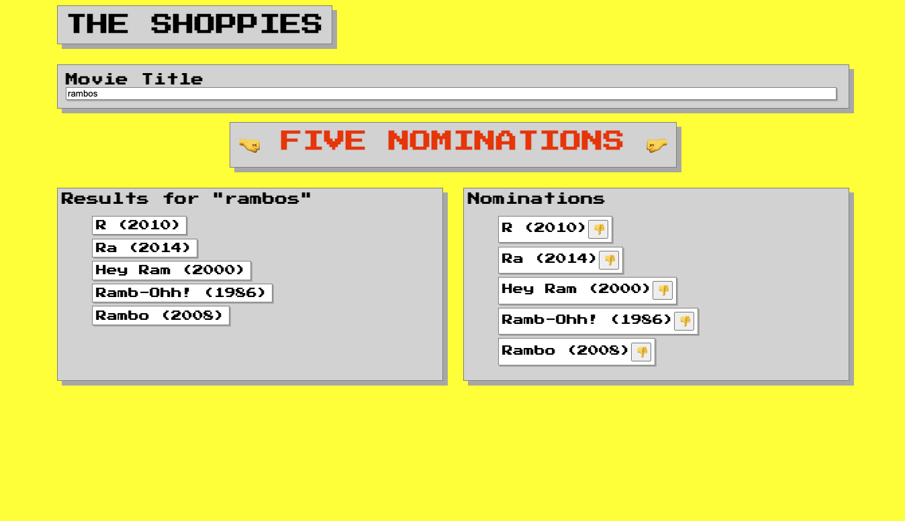

# Aaron Amodt's Shoppies App!
### UX Developer Intern & Web Developer Intern Challenge - Fall 2021

Shopify has branched out into movie award shows and we need your help. Please build us an app to help manage our movie nominations for the upcoming Shoppies.

#### The Challenge

We need a webpage that can search OMDB for movies, and allow the user to save their favourite films they feel should be up for nomination. When they've selected 5 nominees they should be notified they're finished.

We'd like a simple to use interface that makes it easy to:
- Search OMDB and display the results (movies only)
- Add a movie from the search results to our nomination list
- View the list of films already nominated
- Remove a nominee from the nomination list

#### The Result

I've made a SPA using React.  
It's deployed on Netlify here: [https://nifty-davinci-428fe2.netlify.app/](https://nifty-davinci-428fe2.netlify.app/)

Features:
- Search for titles on OMDB and displays the results
- Click the thumbs up to add to nominations list
- Click the thumbs down to remove the nomination
- Live updating of the Results and Nominations lists
- Click on the title to be taken to the IMDB page

This project was a lot of fun.  Thanks for your consideration!